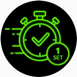
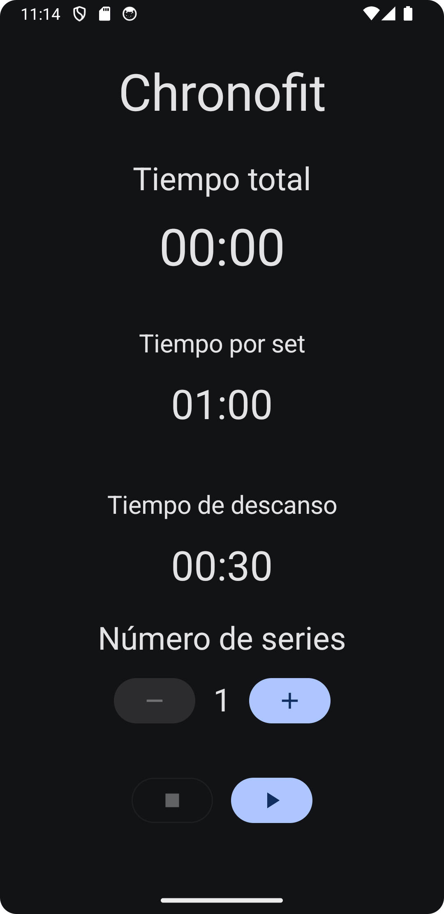
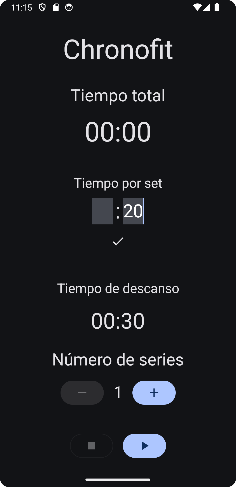
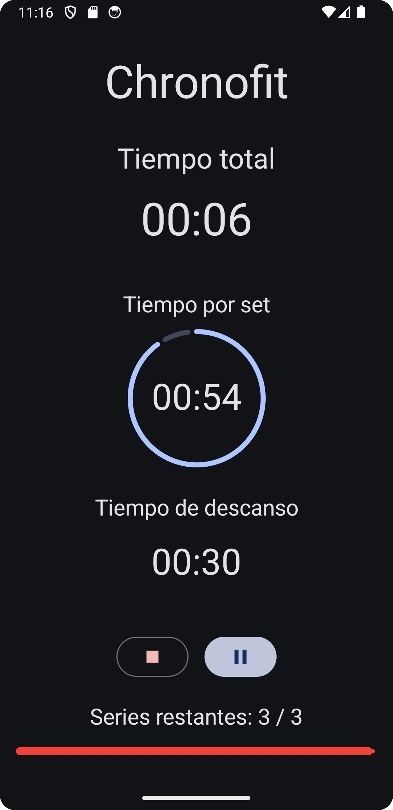
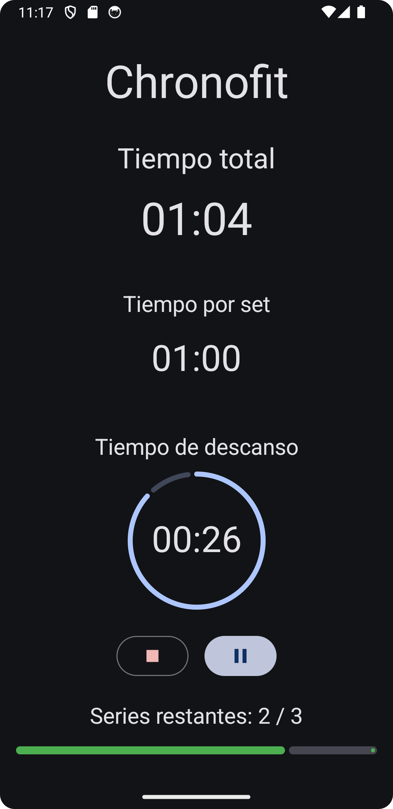

# ChronoFit 🏋️⏱️

Aplicación de temporizador de entrenamiento por intervalos desarrollada en **Kotlin** con **Jetpack Compose**. Permite configurar tiempo de serie, descanso, y número de series, con indicaciones visuales y sonoras.
Las aplicaciones que habian en la playstore tenian anuncios o eran de pago, asi que me he diseñado una :)

## Características 📱

- Configuración flexible de:
  - Duración de series y descansos
  - Número de series
- Reproducción de pitidos en los últimos 3 segundos de cada bloque
  - Pitido normal (2, 3 segundos restantes)
  - Pitido largo (último segundo)
- Barra de progreso total con colores según fase (rojo = serie, verde = descanso)
- Pausar, reanudar o reiniciar el entrenamiento
- Indicaciones visuales en tiempo real con Compose
- Sonido aunque el móvil esté en modo vibración (*uso de `USAGE_MEDIA`*)

## Tecnologías utilizadas 🛠️

- **Kotlin**
- **Jetpack Compose** (UI)
- **ViewModel + StateFlow** (gestión de estado)
- **SoundPool** (para reproducción de sonidos)
- **Hilt** (inyección de dependencias)
- Arquitectura **limpia** dividida en capas: `ui`, `domain`, `infrastructure`, `di`, `common`

## Estructura del proyecto 📁

chrono_fit_app/
- ├── common/
- │ └── constantes/ # Constantes de la app
- ├── di/
- │ └── AudioModule.kt # Módulo Hilt para la inyección del reproductor
- ├── domain/
- │ └── audio/ # Interfaz SoundPlayerI
- ├── infrastructure/
- │ └── audio/ # Implementación con SoundPool
- ├── ui/
- │ └── screens/
- │       └── principal/ # Pantalla principal, Events, State y ViewModel
- └── MainActivity.kt # Entrada principal

## Funcionamiento

1. Al abrir la aplicación, se mostrará el logo:

   

2. A continuación, accederás a la pantalla principal:

   

3. Podrás ajustar el número de series y los tiempos pulsando sobre los valores numéricos, escribiendo los nuevos valores y confirmando:

   

4. Presiona el botón de Play (▶) para comenzar la cuenta atrás:

   

5. Sonarán los pitidos durante los últimos 3 segundos. Al finalizar, se activará el modo de descanso:

   


## Instalación 🔧

1. Clona este repositorio:
   ```bash
   git clone https://github.com/CarlosHernandezCR/Chrono_fit_app.git
2. Abre el proyecto en Android Studio.
3. Ejecuta en un dispositivo físico o emulador con Android 6.0 o superior.

Recursos de sonido 🔊
Ubicados en res/raw/:

- beep.mp3: sonido corto para los segundos 3 y 2

- beep_end.mp3: pitido largo al llegar al último segundo

Contribución 🙌
Las mejoras son bienvenidas
